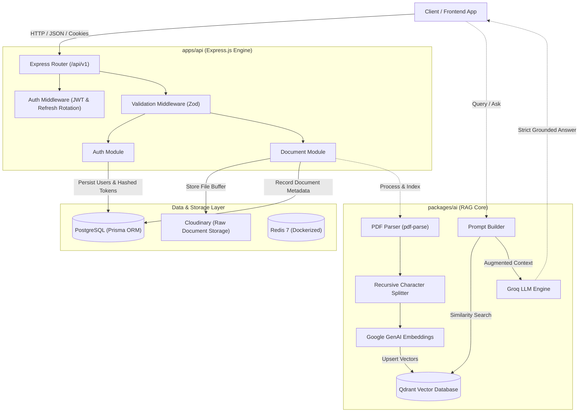

# Axon 🧠

An enterprise-grade, modular RAG (Retrieval-Augmented Generation) and document intelligence platform built with TypeScript, Express, PostgreSQL, Qdrant, Google Generative AI, and Groq.

---

## 📑 Table of Contents

- [Overview](#-overview)
- [System Architecture](#-system-architecture)
- [Key Features](#-key-features)
  - [Implemented](#-implemented)
  - [Planned / In-Progress](#-planned--in-progress)
- [Tech Stack](#-tech-stack)
- [Repository Structure](#-repository-structure)
- [Authentication & Security](#-authentication--security)
- [RAG & Document Processing Flow](#-rag--document-processing-flow)
- [Data Storage & Vector Services](#-data-storage--vector-services)
- [API Reference](#-api-reference)
- [Getting Started](#-getting-started)
  - [Prerequisites](#prerequisites)
  - [Environment Variables](#environment-variables)
  - [Docker Setup](#docker-setup)
  - [Database Migration](#database-migration)
  - [Running the Services](#running-the-services)
- [Roadmap](#-roadmap)
- [Author](#-author)

---

## 🔭 Overview

**Axon** is an AI-powered knowledge and document processing backend. The system is architected as a modular monorepo that separates API delivery from AI/RAG domain logic:

- **`apps/api`**: RESTful API service managing user authentication, role-based access control (RBAC), file uploads via Multer & Cloudinary, and relational metadata persistence via Prisma & PostgreSQL.
- **`packages/ai`**: Standalone AI package providing document parsing (`pdf-parse`), semantic chunking (`@langchain/textsplitters`), vector embedding generation (`@langchain/google-genai`), vector search indexing (`@qdrant/js-client-rest`), and contextual LLM generation (`groq-sdk`).

---

## 🏛️ System Architecture



---

## ✨ Key Features

### ✅ Implemented

- **Dual-Token JWT Authentication**:
  - Stateless Access Tokens (short-lived, 15m default).
  - Stateful Rotating Refresh Tokens (7d default) stored as SHA-256 hashes in PostgreSQL to prevent token reuse and session hijacking.
  - Secure transport via `httpOnly`, `sameSite: strict` cookies and `Bearer` authorization headers.
- **Role-Based Access Control (RBAC)**:
  - Role definitions: `ADMIN`, `OWNER`, `EDITOR`, `VIEWER`.
- **Strict Request Validation**:
  - Request body validation powered by Zod schemas.
- **Document Management**:
  - Direct file upload via Multer memory storage.
  - Automatic offloading of raw assets to Cloudinary.
  - Metadata tracking in PostgreSQL (`UPLOADED`, `PROCESSING`, `COMPLETED`, `FAILED`).
  - Document retrieval, status monitoring, title updates, and cascading deletion.
- **AI & RAG Pipeline (`packages/ai`)**:
  - PDF text extraction with lifecycle cleanup (`pdf-parse`).
  - Semantic chunking via LangChain's `RecursiveCharacterTextSplitter` (1000 chunk size, 150 overlap).
  - High-dimensional vector embeddings via Google Generative AI (`text-embedding-004`).
  - Vector collection provisioning and cosine similarity search using Qdrant.
  - Contextual prompt synthesis preventing hallucinations through strict grounding constraints.
  - Ultra-fast LLM response generation powered by Groq SDK.
- **Containerized Infrastructure**:
  - Pre-configured `docker-compose.yml` for PostgreSQL 16, Redis 7, and Qdrant.

### ⏳ Planned / In-Progress

- **API-to-RAG Integration**: Direct binding between API document uploads and asynchronous Qdrant vector indexing worker queues.
- **Chat & Query Endpoints**: API routes in `apps/api/src/modules/chat` for conversational document Q&A and session history.
- **Background Job Queue**: Redis-backed queue (BullMQ) for asynchronous embedding and document processing.
- **Web Search Tool**: Agentic search integration via Tavily (`packages/ai/src/tool/tavily.tool.ts`).
- **Web Frontend**: Modern single-page client interface inside `apps/web`.

---

## 🛠️ Tech Stack

| Category | Technology | Description |
| :--- | :--- | :--- |
| **Runtime & Language** | Node.js, TypeScript | Type-safe execution across monorepo |
| **Backend Framework** | Express 5 | Fast, unopinionated web framework |
| **Database & ORM** | PostgreSQL 16, Prisma 7 | Relational persistence with PG adapter |
| **Vector Database** | Qdrant | Vector similarity search engine |
| **Cache & Queue** | Redis 7 | Pre-configured in Docker |
| **AI & Embeddings** | Google Gemini (`@langchain/google-genai`) | Dense semantic embeddings |
| **LLM Inference** | Groq SDK (`groq-sdk`) | High-speed LLM completion |
| **Document Processing** | `pdf-parse`, `@langchain/textsplitters` | Text extraction & recursive chunking |
| **Cloud Storage** | Cloudinary | Cloud file and raw document hosting |
| **Authentication** | JSON Web Tokens (`jsonwebtoken`), `bcrypt` | Hashed token rotation & password security |
| **Validation** | Zod | Schema validation middleware |
| **Containerization** | Docker, Docker Compose | Multi-container local infrastructure |

---

## 📂 Repository Structure

```text
Axon/
├── apps/
│   ├── api/                           # Core REST API service
│   │   ├── prisma/
│   │   │   └── schema.prisma          # PostgreSQL schema (User, Document)
│   │   └── src/
│   │       ├── config/                # Environment, Cloudinary, and Prisma setup
│   │       ├── middlewares/           # Auth, error handler, Multer, and Zod validator
│   │       ├── modules/
│   │       │   ├── auth/              # Auth routes, controllers, schemas, services
│   │       │   ├── document/          # Document upload, CRUD, status management
│   │       │   └── chat/              # Chat module (planned)
│   │       ├── routes/                # Unified /api/v1 router
│   │       ├── types/                 # Express and module typings
│   │       ├── utils/                 # Token, password, hashing, and error helpers
│   │       ├── app.ts                 # Express application definition
│   │       └── index.ts               # HTTP server bootstrap & DB connection
│   └── web/                           # Frontend application (planned)
├── packages/
│   ├── ai/                            # AI & RAG domain package
│   │   └── src/
│   │       ├── document/              # PDF text parser & text splitter
│   │       ├── embeddings/            # Google Gemini embedding service
│   │       ├── llm/                   # Groq LLM client & completion handler
│   │       ├── rag/                   # Prompt builder, retriever, and RAG orchestrator
│   │       ├── tool/                  # Agent tools (Tavily search placeholder)
│   │       └── vector/                # Qdrant client, collection setup, and upsert
│   └── shared/                        # Shared types and utilities across packages
├── docker-compose.yml                 # Local services (PostgreSQL, Redis, Qdrant)
├── .dockerignore
└── .gitignore
```

---

## 🔐 Authentication & Security

Axon utilizes a hardened JWT authentication model designed to mitigate token theft:

1. **Registration / Login**:
   - Passwords hashed using `bcrypt` before database persistence.
   - An **Access Token** (short-lived, 15m) and a cryptographically generated **Refresh Token** (long-lived, 7d) are generated.
   - The Refresh Token is hashed via SHA-256 and stored in the database (`users.refreshToken`).
   - Both tokens are returned in the response payload and set as `httpOnly`, `sameSite: strict` cookies.
2. **Access Token Verification**:
   - The `authenticate` middleware inspects the configured access cookie or the `Authorization: Bearer <token>` header.
   - Verifies signature and attaches the active user record to `req.user`.
3. **Refresh Token Rotation & Reuse Detection**:
   - The `/api/v1/auth/refresh` endpoint accepts the active refresh cookie.
   - Verifies the JWT and compares the incoming token hash against the database.
   - **Reuse Detection**: If a hash mismatch is detected, the stored token is invalidated immediately (`refreshToken: null`), forcing re-authentication.
   - Upon successful verification, a brand new token pair is issued and the database hash is updated.
4. **Logout**:
   - Invalidates the user's stored refresh token in the database and clears authentication cookies.

---

## 🔄 RAG & Document Processing Flow

The RAG workflow implemented in `packages/ai` operates through the following stages:

```text
[PDF Document]
      │
      ▼
1. PDF Parser (extractPdfText) ────────► Extracts raw text content
      │
      ▼
2. Chunking (splitDocument) ───────────► RecursiveCharacterTextSplitter (1000 chars, 150 overlap)
      │
      ▼
3. Embeddings (getEmbeddings) ─────────► GoogleGenerativeAIEmbeddings (outputDimensionality)
      │
      ▼
4. Vector Storage (upsertDocument) ────► Qdrant Collection (Cosine Distance, UUID points)
      │
  [Query]
      │
      ▼
5. Retriever (documentRetriever) ──────► Qdrant similaritySearch (Top-K vector scoring)
      │
      ▼
6. Prompt Builder (buildPrompt) ───────► Strictly grounded prompt with document context
      │
      ▼
7. LLM Engine (generateResponse) ──────► Groq Chat Completion -> Grounded Answer
```

---

## 🗄️ Data Storage & Vector Services

### 1. PostgreSQL (Prisma ORM)
- **`users` Table**:
  - `id`: UUID primary key
  - `name`: User display name
  - `email`: Unique email address
  - `passwordHash`: Bcrypt hashed password
  - `role`: Role enum (`ADMIN`, `OWNER`, `EDITOR`, `VIEWER`)
  - `refreshToken`: SHA-256 hashed active refresh token
  - `createdAt`, `updatedAt`: Timestamps
- **`Document` Table**:
  - `id`: UUID primary key
  - `userId`: Foreign key relating to `users.id` (Cascading delete)
  - `title`, `originalName`, `mimeType`, `size`
  - `source`: Enum (`FILE`, `URL`)
  - `sourceUrl`: Remote asset URL (Cloudinary)
  - `storageKey`: Cloudinary public identifier
  - `status`: Enum (`UPLOADED`, `PROCESSING`, `COMPLETED`, `FAILED`)
  - `errorMessage`: Diagnostic string if processing fails
  - `createdAt`, `updatedAt`: Timestamps

### 2. Qdrant Vector Store
- Stores vector embeddings generated from chunked document text.
- Configured with Cosine distance metric and parameterized embedding dimensions.
- Vectors are associated with point payloads containing raw text chunks for retrieval reconstruction.

### 3. Redis
- Running via Docker on port 6379, provisioned for caching and asynchronous task queuing.

---

## 📡 API Reference

Base URL: `/api/v1`

### Health Check
| Method | Endpoint | Auth Required | Description |
| :--- | :--- | :---: | :--- |
| `GET` | `/api/health` | No | Verifies API server health |

### Authentication (`/api/v1/auth`)
| Method | Endpoint | Auth Required | Request Body / Cookies | Description |
| :--- | :--- | :---: | :--- | :--- |
| `POST` | `/api/v1/auth/register` | No | `{ name, email, password, role? }` | Registers user & issues token pair |
| `POST` | `/api/v1/auth/login` | No | `{ email, password }` | Authenticates user & issues token pair |
| `POST` | `/api/v1/auth/refresh` | No (Cookie) | Cookie: `refreshToken` | Rotates access & refresh tokens |
| `POST` | `/api/v1/auth/logout` | **Yes** | Cookie / Bearer Header | Invalidates refresh token & clears cookies |
| `GET` | `/api/v1/auth/me` | **Yes** | Cookie / Bearer Header | Retrieves current authenticated user profile |

### Documents (`/api/v1/document`)
| Method | Endpoint | Auth Required | Request Parameters / Body | Description |
| :--- | :--- | :---: | :--- | :--- |
| `POST` | `/api/v1/document/upload` | **Yes** | `multipart/form-data`: `file`, `title?` | Uploads file to Cloudinary & saves metadata |
| `GET` | `/api/v1/document/getAll` | **Yes** | None | Returns all documents owned by user |
| `GET` | `/api/v1/document/:id` | **Yes** | Path param: `id` | Retrieves single document details |
| `PUT` | `/api/v1/document/:id` | **Yes** | Path param: `id`, Body: `{ title }` | Updates document title |
| `DELETE` | `/api/v1/document/:id` | **Yes** | Path param: `id` | Deletes document record |
| `GET` | `/api/v1/document/status/:id` | **Yes** | Path param: `id` | Fetches document processing status |

---

## 🚀 Getting Started

### Prerequisites

- [Node.js](https://nodejs.org/) (v18 or higher recommended)
- [npm](https://www.npmjs.com/) or [pnpm](https://pnpm.io/)
- [Docker & Docker Compose](https://www.docker.com/)


## 👨‍💻 Author

**Nishant Singh**

- GitHub: [@NishantSingh-01](https://github.com/NishantSingh-01)